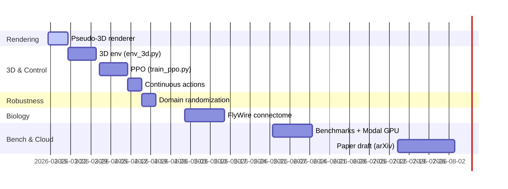

# BioDrone-RL: Connectome-Constrained Sparse Policies for Drone Navigation

**One-liner:** Train a drone navigation policy whose neural architecture is constrained by the fruit fly visual connectome, and test whether biological topology beats dense and random sparse baselines.

## Highlights

- 🧠 **Sparse, masked policy** (MaskedLinear) with 80%+ sparsity.
- 🚁 **Tunnel & gate navigation** environments (Gymnasium, Pygame-based).
- 🖥️ **Apple Silicon (MPS) ready**; lightweight for M1/M2.
- 📈 Baseline **REINFORCE** complete; curriculum training with gates in progress.
- 🎯 Roadmap to **3D env + PPO + domain randomization + FlyWire connectome**.

## Quickstart

```bash
# (Optional) create & activate your venv/conda
python -m venv .venv && source .venv/bin/activate
pip install -r requirements.txt

# Train curriculum with gates (saves to weights/fly_policy.pth)
python train_curriculum.py

# Test the trained policy (text)
python test_policy.py
```

## Repository Structure (active pieces)

- `model.py` — Sparse MaskedLinear policy network (categorical actions).
- `env_simple.py` — 2.5D tunnel (no gates), 7 sensors, 5 actions.
- `env_gates.py` — Tunnel with gates (gap, spacing, rewards).
- `train_curriculum.py` — Curriculum RL: wide/far gates → harder.
- `test_policy.py` — Rollout tester for a saved policy.
- `weights/` — Saved checkpoints (ignored by git).

## Architecture at a Glance

```mermaid
flowchart LR
  S[Sensors (7)] --> M1[MaskedLinear 7→32 (sparse)]
  M1 --> A[ReLU]
  A --> M2[MaskedLinear 32→5 (sparse)]
  M2 --> P[Categorical π(a|s)]
```

## Environments

- **Simple Tunnel** (`env_simple.py`): survive & center; 7 ray sensors (5 horiz, up, down); actions: LEFT/FWD/RIGHT/UP/DOWN.
- **Gate Tunnel** (`env_gates.py`): scrolling tunnel, procedural gates (50–70% tunnel width/height), gate rewards, curriculum-ready (`gate_every` spacing).

## Training (current)

- **Algo:** REINFORCE with return normalization.
- **Device:** Auto MPS on Apple Silicon.
- **Sparsity:** 0.8 (dead synapses kept zero-grad).
- **Curriculum:** `train_curriculum.py`
  - Phase 1: gate_every=40 (wide, far)
  - Phase 2: 30 → 25 → 20 (harder)
  - Gate reward boosted for learnability.

## Roadmap (from context)



## Controls (renderers)

- `python render_3d.py` (when updated): Q quit, SPACE pause, R restart.

## Requirements

- Python 3.10, Gymnasium, Pygame, PyTorch (MPS).
- See `requirements.txt` for pinned versions.

## Contributing

- Issues/PRs welcome. Keep PRs small; include before/after metrics for training changes.

## License

- MIT (recommend for openness); add LICENSE if not present.
